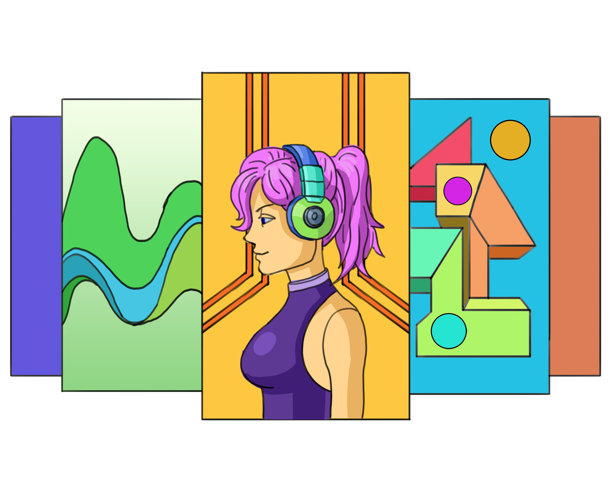
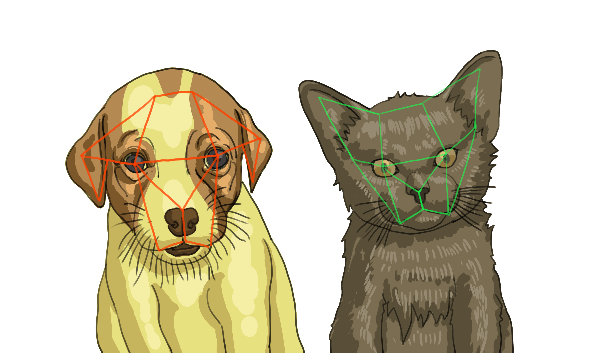
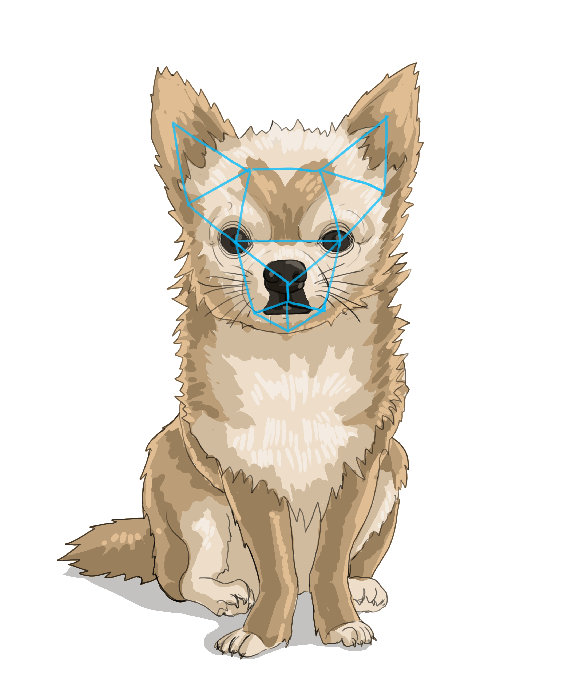
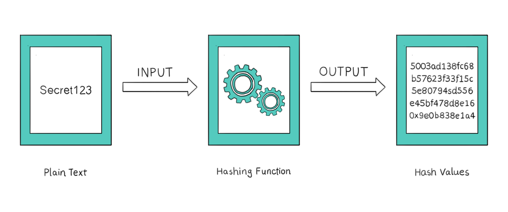
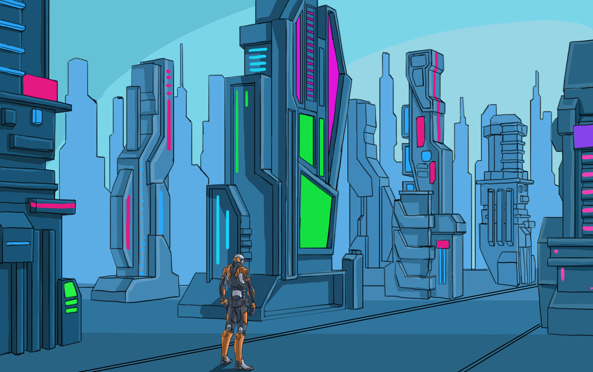
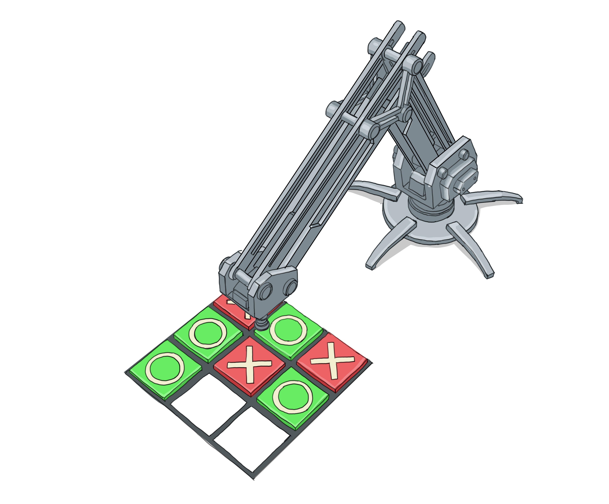
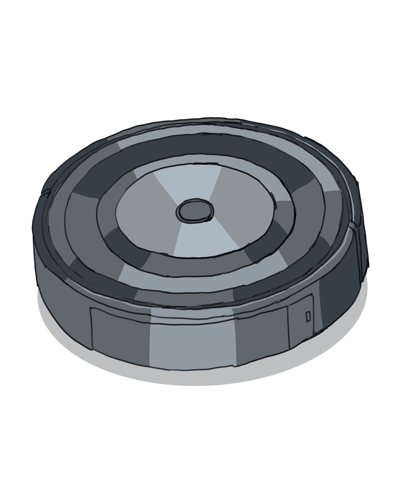
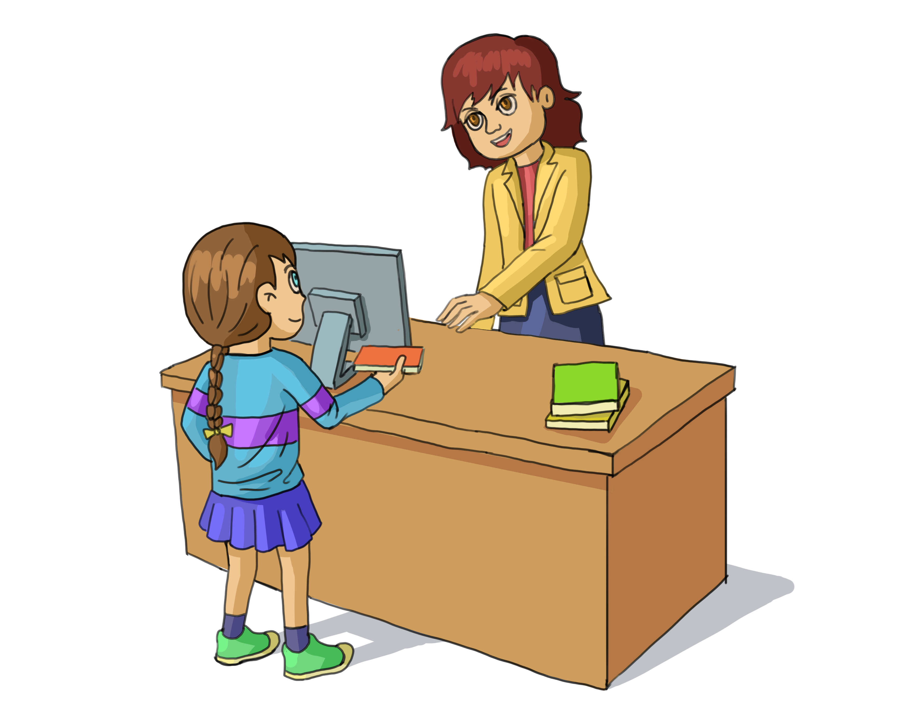

With a solid foundation in programming basics, you're ready to peek into more complex and exciting areas. This chapter will give you a glimpse into advanced fields where programming is making a big impact, inviting you to consider your next steps in the programming landscape.

## Table of Contents

[Introduction to More Advanced Topics](#introduction-to-more-advanced-topics)

- [Artificial Intelligence](#artificial-intelligence)
- [Cybersecurity](#cybersecurity)
- [Game Development](#game-development)
- [Robotics](#robotics)
- [Web Development](#web-development)

[Journey into Programming: Start with What You Love](#journey-into-programming-start-with-what-you-love)

[Questions](#questions)

## Introduction to More Advanced Topics

### Artificial Intelligence

The term "AI", short for "Artificial Intelligence", gets thrown around so much these days that it is impossible to ignore. Companies in all fields are leveraging AI as a vital tool to stay competitive and relevant.

But what is AI?

Simply put, AI involves creating rules and algorithms that enable computers to perform tasks typically requiring human intelligence. These tasks range from simple ones, like following a recipe, to complex ones, like driving a car.

For example, think of a simple AI that plays tic-tac-toe:

```typescript
function PlayTicTacToe(board):
    while "empty space on the board exists" == True:
        if move == "lead to victory":
            // If AI can win with this move, take it
            Make(move)
        else if move == "block opponent victory":
            // If AI can block the opponent's victory, do it
            Make(move)
        END if
    END while

    // If neither winning nor blocking, take a random free space
    Make(move) // Random move
END function

```

This code snippet shows how AI uses predefined rules to determine its next move. It's not actually learning or thinking; it's simply following the programmed instructions to try and win the game. And while this is a simple example, real-world AI systems can be incredibly complex, using thousands or millions of rules to do things like translating languages or predicting the weather.

However, when most people talk about AI, they often mean "Machine Learning" (ML), a subset of AI. ML is distinguished by its focus on learning from data. The more data it processes, the more refined its performance becomes.

For instance, imagine a music streaming app that suggests new songs and artists for you. Just like a friend who learns your music taste over time, the app uses machine learning to analyze your listening history, likes, and skips. It gets better at predicting what you'll enjoy listening to next, creating a personalized playlist that feels like it was handpicked just for you.


*Machine learning refines music choices in a streaming service from user feedback.*

A critical aspect of ML is that it relies on labeled data. This is like giving the machine a completed quiz to study from, so it knows what the correct answers (or classifications) should be. As a concrete example, say we are writing a program that will determine if it sees a cat or a dog in an image. In that case, we'd give the computer examples of labeled data, such as pictures that are already tagged as 'cat' or 'dog'. The machine uses these examples to learn the distinctive features of each animal.

Here's a simplified pseudocode example of how a machine could learn from labeled photos to tell the difference between cats and dogs:

```typescript
function LearnFromPhotos(photoCollection):
    while photo "left in" photoCollection:
        if photo is labeled 'cat':
            LearnFeatures('cat', photo)
        else: // Photo is labeled 'dog'
            LearnFeatures('dog', photo)
        END if
    END while
END function

function GuessAnimal(newPhoto):
    if newPhoto "matches more features of" 'cat':
        return "This is probably a cat"
    else:
        return "This is probably a dog"
    END if
END function

function LearnFeatures(animalType, photo):
    // Code to analyze the photo and extract features based on animalType ('cat' or 'dog')
END function

```

The `LearnFeatures()` function is where the machine learning algorithm examines each labeled photo, identifying features such as ear shape, fur pattern, or tail length. Over time, as the algorithm encounters more labeled photos, it gets better at understanding which features are most likely to be those of a 'cat' or 'dog'. This process is called "training the model".


*Dog and cat faces showing key features for machine learning identification.*

Once trained, the machine can then look at new, unlabeled photos (data it hasn't seen before) and use what it has learned to guess whether they contain a cat or a dog. This guessing is based on the presence and strength of the features it learned during training.


*Chihuahua with cat-like traits, highlighting machine learning classification challenges.*

However, the model isn't infallible. Some dogs resemble cats, and vice versa. The accuracy of an AI model largely depends on the quality and variety of its training data. For instance, initially focusing on features like the distance between the eyes and nose may lead to limited accuracy. By adding and analyzing more features (such as eye size or nose shape), the model's predictive capability can improve. This iterative process of feature selection and model training is crucial in ML.

In summary:

**Traditional AI:**

- Uses hard-coded rules.
- Does not learn from data.
- Makes decisions based on predefined logic.

**Machine Learning:**

- Learns from data using algorithms.
- Can improve its performance over time as it is exposed to more data.
- Makes decisions based on patterns it has learned from the data.

### Cybersecurity

As we delve deeper into the digital era, cybersecurity becomes increasingly crucial. Our conversations, personal information, and even banking transactions are all happening online, making the security of this digital space more important than ever.

Cybersecurity encompasses a range of subfields, each addressing different aspects of digital protection. These include network security, which focuses on protecting data in transit; ethical hacking, where experts think like hackers to find and fix vulnerabilities; cryptology, which involves creating and cracking codes; and cyber forensics, the art of uncovering digital evidence after a security breach. Among these varied and intriguing areas, one of the most directly relevant to everyday users is the management and protection of passwords.

Consider a scenario where you're trying to log into your social media account. Here's a pseudocode example to illustrate how a social media company might handle password authentication:

```typescript
function CheckPassword(inputPassword):
    realPassword = "secret123"  // This is the correct password
    attemptCount = 0            // Start counting attempts

    while attemptCount < 3:
        if inputPassword == realPassword:
            Print("Welcome! You're in.")
            EXIT LOOP  // Stop checking since the password is correct
        else:
            Print("Oops! Wrong password. Try again.")
            attemptCount = attemptCount + 1
            // Ask for the password again
            inputPassword = INPUT "Enter your password: "
        END if
    END while

    if attemptCount == 3:
        Print("Sorry, no more tries allowed.")
    END if
END function

// Example of calling the function with a user's input
Print("Enter your password: ")
userPassword = INPUT
CheckPassword(userPassword)
```

The pseudocode starts by setting the correct password and initializing an attempt counter. The loop allows the user to enter a password up to three times. If the password is correct, the loop is exited, and the user gains access. If the password is incorrect, it prompts the user to try again until the maximum number of attempts is reached.

However, in real-world applications, passwords are not stored in plain text, as shown here. Storing passwords in plain text is highly insecure as it makes them easily accessible to anyone who can breach the database, including hackers. Instead, secure systems use a process called hashing to store passwords.

Hashing transforms your password into a scrambled string of characters, known as a hash. This is done using a hash function, a special algorithm that takes any input text (like a password) and produces a unique hash. Importantly, hashing is a one-way process: converting a password into a hash is straightforward, but reversing a hash back to the original password is extremely difficult, if not impossible.


*A depiction of the hashing process, turning a password into a unique, secure hash.*

Here’s how it works in practice: when you create a password on a website, the system hashes your password and stores this hash. Later, when you log in, the system hashes the password you enter and compares it to the stored hash. If the two hashes match, your login is successful.

This method of storing passwords as hashes increases security. If someone were to access the database, they would only find the hashes, not the actual passwords. Without the ability to reverse these hashes into original passwords, the stolen data is much less useful to a potential attacker.

### Game Development

In the realm of digital creativity, game development stands out as a fascinating fusion of art and science. It's more than just playing games; it's about building them from the ground up. In this field, you combine elements of storytelling and visual art with the logic of programming, creating interactive experiences ranging from simple, engaging puzzles to complex, immersive worlds.


*Immersive game world character, fusing storytelling and coding.*

One of the core concepts in game development is the game loop, a continuous cycle that keeps the game running and responsive. It's the heartbeat of every game, constantly checking for player inputs, updating the game state, and rendering the game world on the screen.

Let's look at a basic pseudocode example for a simple 2D game loop, similar to classic games like Super Mario Bros:

```typescript
function RunGame():
    gameIsRunning = True
    playerScore = 0

    while gameIsRunning == True:
        // Check for player input (like movement or actions)
        playerInput = GetPlayerInput()

        // Update the game state based on player input and other factors
        if playerInput == "jump":
            Jump()
        else if playerInput == "move left":
            MoveLeft()
        else if playerInput == "move right":
            MoveRight()
        END if

        // Update the player's score or game status
        UpdateScore(playerScore)

        // Render or draw the game frame on the screen
        RenderGameScreen()

        // Check if the player wants to exit the game
        if playerInput == "exit":
            gameIsRunning = False
        END if
    END while

    Print("Game Over! Your score: " + playerScore)
END function

function GetPlayerInput():
    // Code to get the player's current action
END function

function Jump():
    // Code for the jump action
END function

function MoveLeft():
    // Code for moving left
END function

function MoveRight():
    // Code for moving right
END function

function UpdateScore(score):
    // Code to update the player's score
END function

function RenderGameScreen():
    // Code to display the game state on the screen
END function
```

In this pseudocode, `RunGame()` is the main function where the game loop resides. It repeatedly checks for player input, updates the game state accordingly (like moving a character or jumping), and then renders the game screen to reflect these changes. The loop continues until the player decides to exit. This basic structure is a fundamental concept in game development, illustrating how games continually process input and update the gaming environment in real-time.

Expanding from the basic game loop, game development covers a wide range of skills and interests. Beyond just moving characters or jumping, you can work on building different game environments, programming AI for non-player characters, or creating storylines that change based on player decisions. Additionally, the field is keeping pace with new technologies like AR and VR, pushing the boundaries of how we interact with game environments and bringing new dimensions to player immersion. In this evolving landscape, game development stands at the forefront of technological innovation, continuously redefining the realm of interactive experiences.

### Robotics

Robotics is a dynamic field that combines technology with practical application, transforming the way we approach tasks and challenges. More than just constructing mechanical devices, robotics involves programming these machines to carry out specific functions, from simple repetitive tasks to complex problem-solving. The field blends the principles of engineering, computer science, and sometimes even biology to create robots that can range from simple automated arms in factories to complex rovers exploring other planets.


*A robot playing tic-tac-toe, showcasing the versatility of robotics programming.*

At the core of robotics is the programming that controls how these machines operate and respond to their environment. This includes writing code that guides their movements, processes sensory input, and makes decisions.

Here's a simple pseudocode example, similar to the algorithm a robotic vacuum cleaner might use to navigate around obstacles:

```typescript
function NavigateRoom():
    while NOT atDestination:
        if ObstacleDetected():
            AvoidObstacle()
        else:
            MoveForward()
        END if
    END while
    Print("Destination reached!")
END function

function ObstacleDetected():
    // Code to detect if there is an obstacle in front of the robot
    // Returns true if an obstacle is detected, false otherwise
END function

function AvoidObstacle():
    // Code for the robot to change direction or take action to avoid the obstacle
END function

function MoveForward():
    // Code to move the robot forward
END function
```

In this pseudocode, `NavigateRoom()` is the main function where the robot continuously checks for obstacles while trying to reach a destination. If it detects an obstacle, it calls `AvoidObstacle()` to change its path; otherwise, it moves forward. This simple decision-making process is fundamental in robotics, allowing robots to interact with and adapt to their environment.


*Programmed vacuum for efficient room cleaning and obstacle avoidance.*

### Web Development

Web development, commonly known as "web dev" among programmers, is the process behind the creation of websites and applications that are part of our daily digital experience. From browsing a news site to logging into a social media platform, web dev plays a crucial role in how these services are built and function.

Let's dive deeper into one of the core functionalities of the web: the client-server interaction. Imagine you're at a library:

- The "web client" is like you, going to the library to find a book.
- The "web server" is like the librarian, who knows where all the books are.

When you ask for a book, the librarian (server) checks if it's available. If it is, they give it to you; if not, they tell you it's unavailable. This is similar to what happens when you use a web browser (client) to visit a website. Your browser asks a server for the website's pages, and the server responds.


*A library visitor requesting to borrow a book, akin to a web page request.*

Here's a simple pseudocode example that mirrors this interaction in web development:

```typescript
// Client-Side Code
function RequestWebPage(url):
    Print("Requesting webpage from: " + url)
    response = SendRequestToServer(url) // Function defined below
    if response != "Error":
        DisplayWebPage(response)
    else:
        Print("Failed to load webpage.")
    END if
END function

// Server-Side Code
function SendRequestToServer(url):
    if url "exists in" server:
        pageContent = GetPageContent(url) // Function defined below
        return pageContent
    else:
        return "Error: Page not found"
    END if
END function

function GetPageContent(url):
    // Code to retrieve the webpage content based on the URL
    // Returns the HTML/CSS/JS content of the page
END function
```

In this pseudocode, the `RequestWebPage(url)` function on the client side (like your web browser) asks the server for a specific webpage by calling `SendRequestToServer(url)`. The server, through `SendRequestToServer(url)`, checks if the requested URL is available. If it is, the `GetPageContent(url)` function retrieves the webpage's content and sends it back to the client. The client then displays this content if there's no error, or shows an error message if the page can't be found. This process exemplifies the basic request-response pattern of web interactions, where the client requests data and the server responds accordingly.


*A laptop and phone depicted as clients interacting with a server via the internet, highlighting the flow of web interactions.*

This foundational model of clients sending requests to servers, and servers responding accordingly, is central to the operation of the internet. In fact, this happens to be a basic example of key concepts in web development known as front-end and back-end.

In web development, the 'front-end' is what you, as the user, see and interact with on a website. It's all the client-side parts - the design, the buttons, and the layout. On the other side, the 'back-end' is the server-side of things. It does all the behind-the-scenes work like processing your requests, accessing and managing databases, and sending back data to the front-end.

As more of our daily life moves online, the skills learned in web development become increasingly valuable, opening doors to creating exciting and impactful digital experiences for everyone.

## Journey into Programming: Start with What You Love

The secret to excelling in programming, or any skill, really boils down to enjoying what you're doing. It's about finding that spark of interest and fun in coding. When you love what you do, learning and growing in that area becomes much more natural and exciting.

The best way to improve is to start coding. Choose something that fascinates you, something you're eager to build or be a part of, and jump right in. If your dream project feels too complex for now, no worries! Start with something simpler and gradually level up. Every project, no matter its size, is a step forward on your coding path.

Remember, in this book, we've been working with pseudocode, which isn't a real programming language. But the core ideas and logic you've learned here are the same ones you'll use in any programming language. Think of what you've learned as the foundation upon which you can build as you explore real programming languages and start bringing your own ideas to life.

So, what's next for you? Maybe you'll start with a simple website, a small game, or even a basic app. The options are endless. The most important thing is to keep practicing, keep learning, and most importantly, keep enjoying the process of creating and solving problems with code. Your journey into programming has just begun, and the path ahead is yours to shape.
