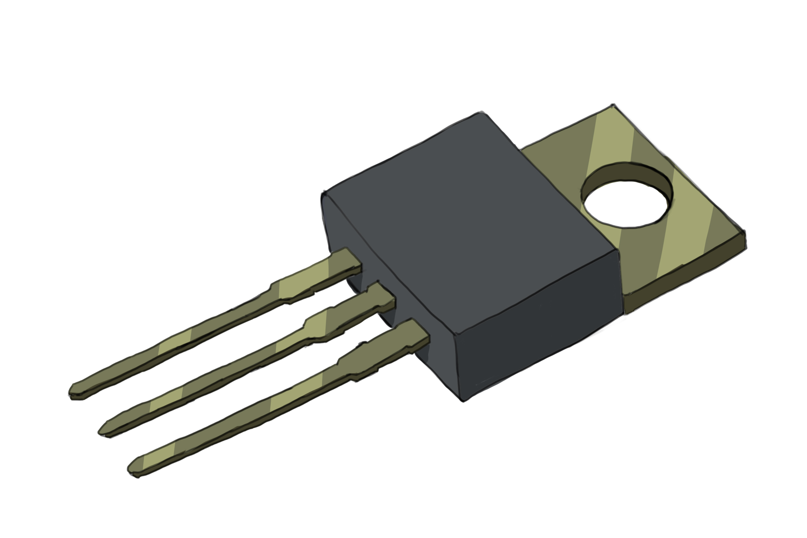
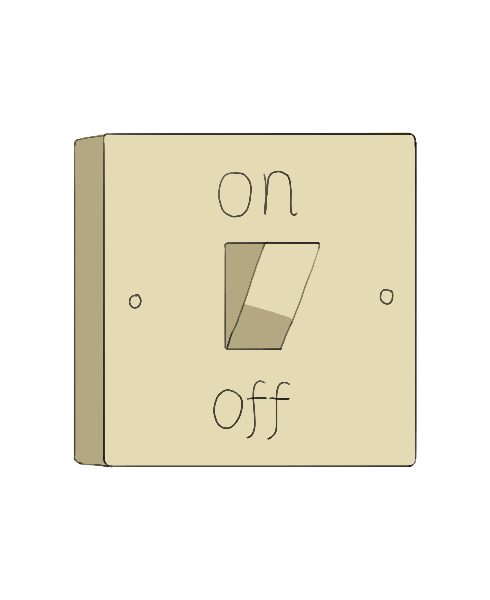
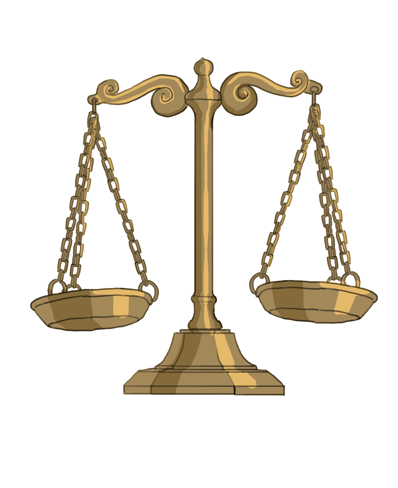
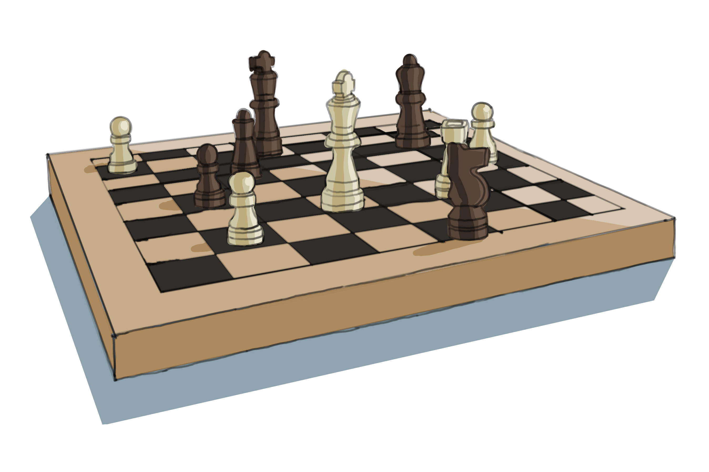

In our everyday lives, we make countless decisions based on conditions: if it rains, take an umbrella; if it's cold, wear a jacket. Similarly, in programming, decision-making is a crucial aspect, enabling the program to react differently to different inputs or situations.

## Table of Contents

[A Brief Review of Transistors](#a-brief-review-of-transistors)

- [The Binary Nature of Transistors](#the-binary-nature-of-transistors)
- [Connecting Transistors to Programming: Boolean Values](#connecting-transistors-to-programming-boolean-values)

[Introducing Pseudocode and Decision-Making in Programs](#introducing-pseudocode-and-decision-making-in-programs)

- [Comparison Operators](#comparison-operators)
- [Logical Operators](#logical-operators)

[From Math to Everyday Decisions](#from-math-to-everyday-decisions)

[Activities](#activities)

[Questions](#questions)

## A Brief Review of Transistors

Imagine a tiny switch, so small that millions of them could fit on the tip of your finger. This is a transistor. It's a device that can either allow an electric current to flow through it (like turning on a light) or stop it entirely (like turning the light off).


*A transistor, an electronic switch controlling electricity flow.*

In essence, a transistor has two primary states:

- On: This is when it allows electricity to pass through. We can liken this to opening a faucet and letting water flow.
- Off: This is when it prevents electricity from flowing, similar to closing a faucet to stop the water.

### The Binary Nature of Transistors

The fact that a transistor has only two states introduces us to a fundamental concept: "binary." In the realm of computers, binary refers to the system of representing values using only two symbols, usually 0 and 1. In the case of our transistor, "on" can be thought of as "1", and "off" as "0".

> **Note:** The term 'binary' focuses on two states. In contrast, "unary" describes one state, "ternary" represents three states, and "quadrinary" means four states. However, computers primarily use binary logic because of the inherent on/off nature of electrical circuits and transistors.

### Connecting Transistors to Programming: Boolean Values

When you start programming, you'll encounter a concept called "boolean values." Named after George Boole, a 19th-century mathematician, booleans in programming have just two values: "True" and "False".

Do you see the parallel? Just as a transistor can be "on" (1) or "off" (0), a boolean value can be `True` (equivalent to 1) or `False` (equivalent to 0).


*A simple on/off switch, illustrating the binary nature of boolean values in programming.*

To grasp the significance of booleans, think about how we evaluate statements in our daily life. For instance, the statement "The sky is blue" can be true during a clear day, but false during the night. Similarly, in programming, boolean values emerge from evaluating conditions or statements.

> **Note:** A statement is a sentence or expression that can be evaluated as either true or false, but not both. In programming, statements provide a way to represent facts or conditions that the computer can then use to make decisions.

Take the example "5 is greater than 4". When a computer processes this statement, it evaluates the condition and concludes it to be `True`. In contrast, the statement "6 is greater than 4 and less than 3" is contradictory, and thus, it evaluates to `False`.

Programming uses this true or false logic for decision-making, fundamentally connecting the physical world of transistors with the logical realm of booleans.

## Introducing Pseudocode and Decision-Making in Programs

Pseudocode is a method to design and represent algorithms without the strict structure of a particular programming language. It allows programmers to focus on logic and flow, without worrying about the syntax of any specific programming language.

Before writing some pseudocode, there are a few topics we should cover first.

### Comparison Operators

Before delving into the pseudocode, let's familiarize ourselves with some basic comparison operators used in decision-making:

- **\>** : Greater than.
  - `5 > 3` results in `True`.
  - `2 > 8` results in `False`.
- **<** : Less than.
  - `2 < 4` results in `True`.
  - `6 < 3` results in `False`.
- **==** : Equal to.
  - `7 == 7` results in `True`.
  - `5 == 8` results in `False`.
- **!=** : Not equal to.
  - `5 != 8` results in `True`.
  - `7 != 7` results in `False`.
- **<=** : Less than or equal to.
  - `4 <= 5` results in `True`.
  - `7 <= 7` results in `True`.
  - `9 <= 6` results in `False`.
- **>=** : Greater than or equal to.
  - `6 >= 3` results in `True`.
  - `8 >= 8` results in `True`.
  - `4 >= 10` results in `False`.

> **Note:** We use `==` to check for equality in most programming languages instead of `=`. The reason for this will become clear in the next chapter, where we will see `=` used for something else. For now, remember to use `==` when making comparisons.

These operators help us compare values and determine the relationship between them. They're fundamental to setting up conditions in our code.


*A scale, showcasing the principle behind comparing variables.*

### Logical Operators

Beyond simple comparisons, we often need to check multiple conditions at once or invert the logic of a condition. This is where logical operators come in. The three primary logical operators are `AND`, `OR`, and `NOT`.

- `AND` : **Both** conditions must result in `True` for the overall statement to result in `True`.
  - The statement `5 > 3 AND 6 > 4` results in `True` because both individual conditions result in `True`.
  - However, `5 > 3 AND 6 < 4` is `False` because even though the first condition is `True`, the second is `False`.
- `OR` : **At least one** condition must result in `True` for the overall statement to be `True`.
  - The statement `5 > 3 OR 6 < 4` is `True `because at least one of the conditions (the first one) is `True`.
  - `2 < 1 OR 3 < 2` is `False` because both individual conditions are `False`.
- `NOT` : **Inverts** the truth value of the condition.
  - A statement such as `5 > 3` is `True`. Using `NOT` inverts this, making the statement `NOT(5 > 3)` result in `False`.
  - Conversely, the statement `2 > 3` which is `False`, therefore `NOT(2 > 3)` will be `True`.

These operators allow for more complex conditions and evaluations. For instance, imagine you're programming a system that checks if a user is allowed to view a specific piece of content. You might have conditions like:

- The user must be logged in **AND** the user must have a premium subscription.
- The content must be available in the user's region **OR** the user has a "global pass".

Using logical operators like **AND**, **OR** and **NOT** helps us set up complex conditions for making decisions in our programs. They allow us to mirror real-life decision-making in our code.


*A chessboard setup, symbolizing strategic decision-making akin to using logical operators in programming.*

## From Math to Everyday Decisions

Until now, our examples have primarily focused on numbers. However, programming isn't confined to mathematical operations. Often, the conditions we evaluate are abstract, representing real-world scenarios. The logical structure remains consistent, regardless of whether you're comparing numbers or determining whether it's raining.

For instance, `raining` might be a variable in our program representing whether it's raining or not. If it's raining, `raining` is `True`; if not, `raining` is `False`. Another variable, `temperature`, could represent the current temperature.

> **Explanation of variables:** Think of these variables as containers. Instead of holding a fixed value, like a constant temperature of 25°C, **var**iables can **var**y; they can hold different values at different times. For instance, `temperature` could be `25°C` today and `23°C` tomorrow. Similarly, today the variable `raining` might be `True`, but tomorrow it could be `False`.

When programming real-world applications, we use variables like `raining` or `temperature` to symbolize and manage real-world data. Our decision-making constructs and logical operators interact with these variables in the same way they would with regular numbers.

> **Important:** In programming, a "construct" is a fundamental piece or feature of the language that serves as a building block. Constructs provide a way to introduce structure, repetition, decision-making, and more into our code. For decision-making, common constructs are `if`, `else`, and `else if` (sometimes written as `elif`). They are very intuitive and you will see them in action in the Activities section below.

This dynamic nature of variables lets our programs react and make decisions based on the current situation or data, whether that data represents numbers, weather conditions, user inputs, or any other conceivable scenario.

With this understanding, we can now delve into real-world problems like deciding whether to hold an outdoor event based on the weather forecast.

## Activities

We will be answering these questions using pseudocode. You are not expected to be able to answer these on yor own just yet.

### Activity #1

Write a program that evaluates a number to determine if it's positive, negative, or zero.

### Possible Answer #1

We start by taking an input (from the user, for example):

```typescript
INPUT number
```

Next, we must decide what to do based on the number's value. This is where the `if .. then:` construct comes in.

If the number is greater than zero, we can say it's positive:

```typescript
if number > 0 then:
    PRINT "The number is positive."
```

> In programming, the term "print" refers to displaying text or other data on the screen, rather than producing a physical copy with a printer. It's a command used to output information to the user.

But what if it's not? We need another check, and that's where `else if` proves useful. It's like saying, "if the previous conditions weren't met, then check this one".

If the number is less than zero, it's negative:

```typescript
else if number < 0 then:
    PRINT "The number is negative."
```

Lastly, if the number isn't positive or negative, it must be zero. That's where `else` comes in. It's our catch-all for "if none of the above conditions are met, do this":

```typescript
else:
    PRINT "The number is zero."
```

And, to neatly conclude our decision-making constructs, we use:

```typescript
END if
```

Putting it all together, we have

```typescript
INPUT number

if number > 0 then:
    PRINT "The number is positive."
else if number < 0 then:
    PRINT "The number is negative."
else:
    PRINT "The number is zero."
END if
```

By outlining logic in pseudocode, transitioning to actual coding in any programming language becomes a smoother process, as the core logic remains consistent.

### Possible Answer #2

There are often multiple ways to solve a problem, with the solution varying based on how conditions are evaluated and in what order. Without going into all the steps, here is the final pseudocode:

```typescript
INPUT number

if number == 0 then:
    PRINT "The number is zero."
else if number > 0 then:
    PRINT "The number is positive."
else:
    PRINT "The number is negative."
END if
```

In this approach, we first check if `number` equals 0. If not, we then determine if `number` is greater than 0. Finally, the else statement handles any remaining scenarios, which in this case, are when `number` is less than 0.

### Activity #2

Suppose you're organizing an outdoor event. You'll proceed if:

- The forecast does not predict rain.
- The temperature is between 18°C and 30°C.

Write corresponding pseudocode for such a program.


*An umbrella, for planning events with weather in mind.*

### Answer

**Evaluating Rain Forecast:**
We want to check if it's "not raining". Here's how we can understand the `NOT raining` condition:

- The `raining` variable would be `True` if it's raining and `False` if it isn't.
- Using `NOT` in front of `raining` inverts its truth value. So, if `raining` is `True`, `NOT raining` becomes `False`, and vice versa.
- For our event to proceed, we want it to be the case where it's not raining, so we're looking for the scenario where `NOT raining` is `True`.

In pseudocode:

```typescript
if NOT raining:
```

**Evaluating Temperature:**
We want the temperature to be between 18°C and 30°C. In other words, we want the following condition to be True:

```typescript
temperature >= 18 AND temperature <= 30
```

Combining both conditions, our complete decision-making pseudocode becomes:

```typescript
if NOT raining AND (temperature >= 18 AND temperature <= 30) then:
    proceed_with_event
else:
    reschedule_event
END if
```

By breaking down our conditions in this way, we ensure that the event only proceeds if it's not raining and the temperature is within our desired range.
