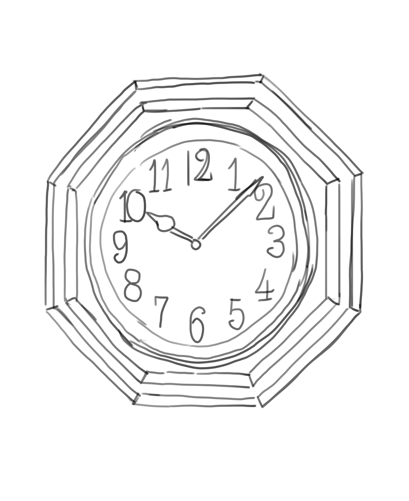
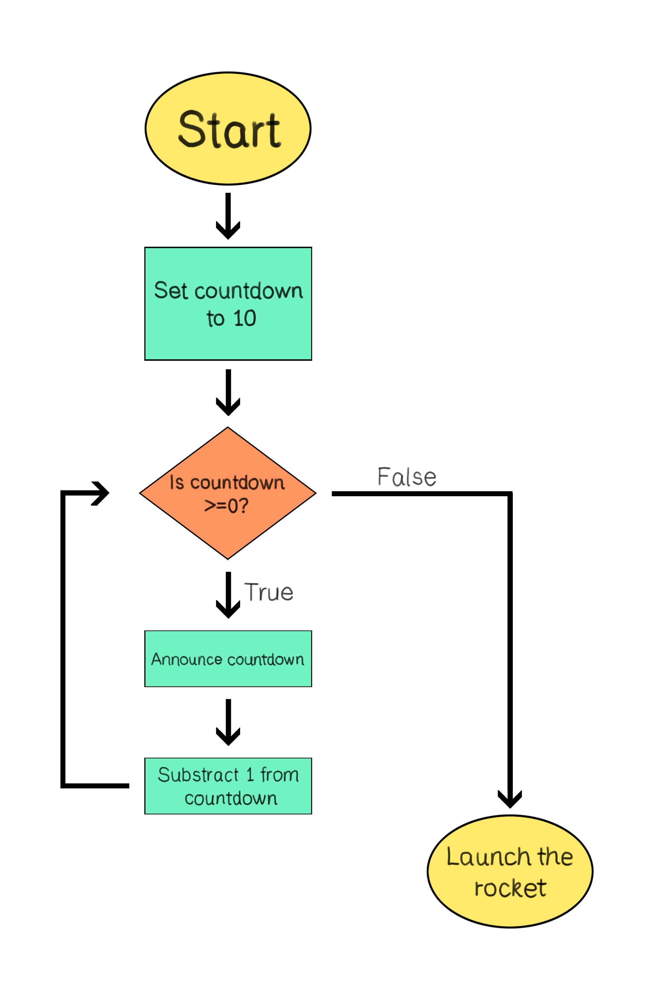
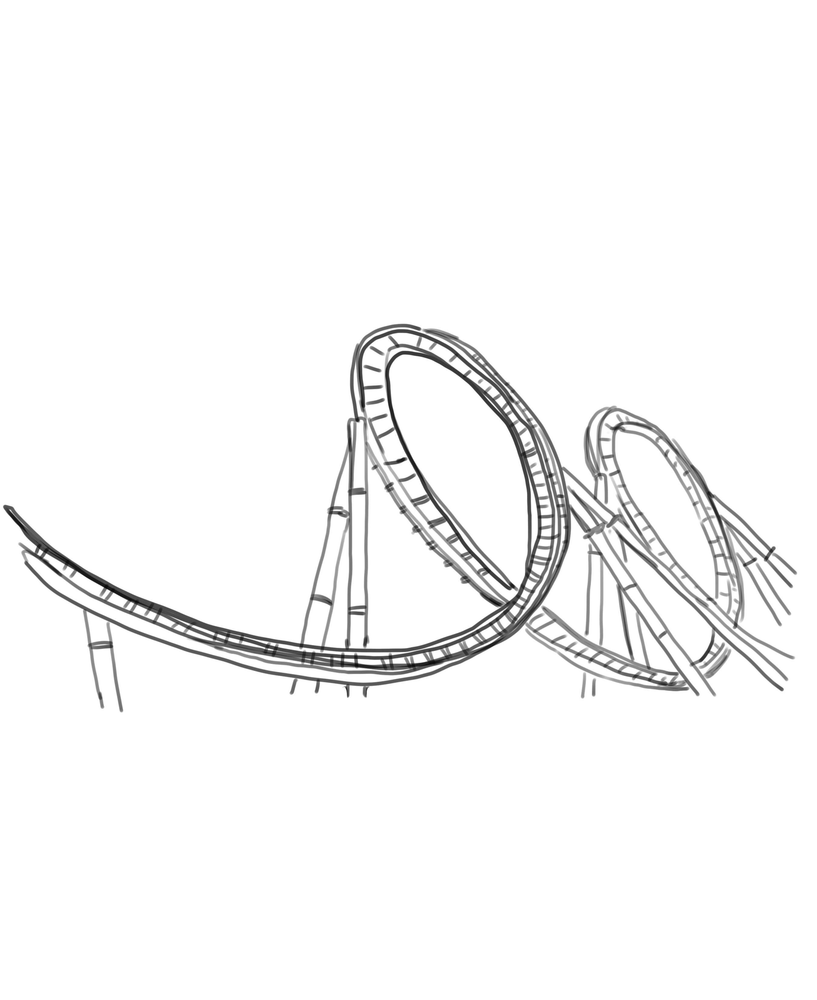

In our daily lives, we encounter many repetitive tasks, whether it's setting an alarm each night or brushing our teeth every morning. Similarly, in programming, there's a concept that allows us to handle repetitive actions efficiently: loops. Dive into this chapter to discover how loops work in the world of coding.

## Table of Contents

[Understanding the Concept of Loops](#understanding-the-concept-of-loops)

[Use Cases of Looping](#use-cases-of-looping)

[The While Loop](#the-while-loop)

- [Example 1: Printing "Hello World 10 times](#example-1-printing-hello-world-10-times)
- [Example 2: Rocket Launch Countdown](#example-2-rocket-launch-countdown)

[Nested Loops](#nested-loops)

[Activities](#activities)

## Understanding the Concept of Loops

Loops are a fundamental concept in programming. They allow us to execute a set of instructions multiple times, which is often referred to as "iteration." Instead of writing the same code over and over again, a loop provides a cleaner way to repeat actions.

> In programming, to "execute" a program or set of instructions means to run the code, allowing it to perform the defined tasks or operations. It's the process where the computer follows the program's commands, one by one, to achieve a desired outcome.



Imagine playing your favorite video game. There are certain elements in that game that are repetitive, all thanks to loops. Here are a few:

- **Gameplay Music:** That catchy tune that plays over and over in the background? It's looped to create a consistent ambiance.
- **Non-Playable Characters (NPCs):** Characters like guards that patrol the same route or vendors in a marketplace who follow a fixed path are repeating their actions through loops.
- **Respawning Items:** Ever noticed how some collectible items or power-ups reappear in the same spot after a while? That's a loop ensuring you never run out of challenges or rewards.
- **Animated Backgrounds:** The moving clouds, flying birds, or flowing rivers that bring a game environment to life? These are often looped animations, adding depth without the need for constant new animations.

Using loops, developers can instruct the game to repeat specific actions seamlessly, enhancing the overall gaming experience. This technique is one of the most widely used and fundamental in a programmer's  toolkit!

### Use Cases of Looping

Loops are incredibly useful in scenarios where:

- A specific action needs to be repeated multiple times.
- An action must be executed until a particular condition is satisfied.
- We have a collection of items and want to perform the same operation on each item.

Using loops not only saves time but also ensures our code remains clean and efficient.

## The While Loop

When you start actually programming, you'll notice that you can't just say *"Loop 5 times"*; it's a bit more complicated than that.

So in this section, let's take a closer look at the core components of what's known as a **while loop**.

### Example 1: Printing "Hello World" 10 times

One of the classic exercises in programming is to make your program say "Hello World". Let's explore how a loop can be used to print this message 10 times.

In order to print the message once, we write the following line of code:

```typescript
PRINT "Hello World"
```

It's that simple to display "Hello World" onto the screen.

Now, to display it 10 times, the inefficient way of doing it is as follows:

```typescript
PRINT "Hello World"
PRINT "Hello World"
PRINT "Hello World"
// ... (repeat 6 more times)
PRINT "Hello World"
```

Loops provide us with a much quicker way of doing this. Consider the following:

```typescript
while counter < 10:
    PRINT "Hello World"
```

In this while loop, we're looking at a simple but fundamental control structure in programming. Here’s how its components work together:

**While Loop Keyword:** The loop begins with the keyword `while`, signaling the start of a while loop. This keyword is crucial as it tells the program that what follows is a condition to be checked.

**Condition Check:** Next we have a condition check: `counter < 10`. Before each iteration, the loop evaluates this condition. If the condition is true, the loop continues and executes the code inside its body. If it's false, the loop stops, and moves onto the code that follows the loop body.

**Loop Body:** The indented block of code following the while statement is the loop's body (`PRINT "Hello World"` in this case). This code is executed repeatedly as long as the loop's condition remains true. Indentation is achieved by using a tab at the start of a line, or by inserting four spaces. This creates a visual hierarchy.

**Execution Flow:**

- In each loop iteration, the program checks if `counter` is less than 10.
- If this is true, the program prints "Hello World".
- After executing the loop body, control returns to the top of the loop, and the condition is checked again.

There is a problem however: what is the value of `counter`? Should we start `counter` at 0, 1, 5, 10? We need to define this explicitly in our program. Typically, in such scenarios, we start counting from 0. So, let’s initialize `counter` to 0 right before the loop starts:

```typescript
counter = 0

while counter < 10:
    PRINT "Hello World"
```

We're almost done! Now we have a variable called `counter`, set to 0, and while `counter` is less than 10, the program will print "Hello World" onto the screen. Do you see a problem here?

We want to print 10 times. If we run this program, it will print "Hello World" indefinitely. Why?

Because `counter` is 0, and 0 is always less than 10. The while loop will keep asking "is `counter < 10` `True` or `False`?" Since "0 is less than 10" is always `True`, the "body" of the while loop will always be executed.

For that reason, we have to update the value of `counter` after every iteration, like so:

```typescript
counter = 0

while counter < 10:
    PRINT "Hello World"
    counter = counter + 1
```

Now, `counter` starts at 0, but it gets incremented by 1 each time the loop body is entered. Here is step by step what happens:

1. `counter` is set to 0.
2. Empty line get's skipped.
3. The `while` loop condition is checked: since `counter` is currently set to 0, the program checks if "0 < 10". Because this statement is `True`, the body of the while loop is entered.
4. "Hello World" is printed onto the screen.
5. `counter` is incremented by 1. Since `counter` was previously 0, it is now updated to be 1.
6. The program returns to check the `while` loop condition: since `counter` is currently set to 1, the program checks if "1 < 10". Because this statement is `True`, the body of the while loop is entered.
7. "Hello World" is printed onto the screen again (for the second time).
8. `counter` is incremented by 1 again. Since counter was previously 1, it is now updated to be 2.
9. The program returns to the `while` loop condition: with `counter` now at 2, it checks if "2 < 10". This is `True`, so it enters the loop body once more.

...

27. At the 9th iteration, `counter` is 8. The condition "8 < 10" is `True`, so "Hello World" is printed, and `counter` becomes 9.
28. At the 10th iteration, `counter` is 9. The condition "9 < 10" is still `True`, so "Hello World" is printed for the tenth time, and `counter` is incremented to 10.
29. The program returns to the `while` loop condition: with counter now at 10, it checks "10 < 10". This statement is `False`, so the loop does not enter its body, and the program execution moves on, marking the end of the loop.

This example is a fundamental illustration of how loops can automate repetitive tasks, like printing a message multiple times.

> Note that we could have had `counter` be the same as the "iteration" number, e.g., at the 1st iteration, `counter` is 1, at the 2nd iteration, `counter` is 2, etc. All we had to do was start `counter` from 1 instead of 0, but it is convention for computers to start counting from 0.

### Example 2: Rocket Launch Countdown

Rocket launches always start with that dramatic countdown: "10, 9, ..., 3, 2, 1, Blast off!". Let's break down how a loop might handle this!


*Flowchart representation of the rocket launch countdown.*

1. **Starting Point** (*Start*): The journey begins here, at the "launch pad" of our mission.
2. **Initialization** (*Set countdown to 10*): As we prepare for launch, the loop gets ready by setting the starting point of our countdown at 10.
3. **Condition** (*Is countdown > 0?*): The loop asks, "Is there still time left on the countdown?". If the countdown is still greater than 0, the loop continues with the countdown. But once it reaches 0, the loop is exited.
4. **Execution** (*Announce countdown*): With every tick of the countdown, the loop announces the current number, letting everyone know how many seconds remain until launch.
5. **Update** (*Subtract 1 from countdown*): After each announcement, the loop decreases the `countdown` by 1. This action ensures that we're progressing toward the blast-off.
6. **Exit Point** (*Launch the rocket*): When `countdown` hits 0, the loop's work is done, and it's time for the rocket to soar into the skies!

Here is the pseudocode version of this situation, with comments (non-executable lines) denoted with `//`:

```typescript
// Initialization: Initialize the countdown
countdown = 10

// Condition: Begin the while loop
WHILE countdown > 0:
    // Execution: Print the current countdown number
    PRINT countdown

    // Update: Decrease the countdown number by 1
    countdown = countdown - 1

// Exit Point: Once the loop ends, announce the launch
PRINT "Blast off!"
```

**Overview:** This code begins by initializing the `countdown` variable to 10. In each iteration of the loop, it checks if `countdown` is greater than 0; if so, the current countdown number is printed. After each print, `countdown` is reduced by 1. This decrementing continues until `countdown` reaches 0, at which point the loop terminates. The final action outside the loop is printing `"Blast off!"` signaling the end of the countdown and the launch of the rocket.

## Nested Loops

In programming, we can place loops inside other loops, a concept known as nesting. This approach is particularly powerful for handling tasks that involve multiple layers or dimensions.

[Illustration of 2 gears, one large one small]

### Nested Loop Example: Amusement Park

Imagine this: you're on a weekend trip to an amusement park with an all-inclusive two-day ticket pass. You're super excited and have decided that on each day, you'll ride 5 different roller coasters.

This situation is a great example of nested loops. Think of the two-day weekend as the outer loop. Now, inside each day (each cycle of the outer loop), there's another loop for the five times you ride the roller coasters.



Here's a breakdown:

- Day Loop (Outer Loop): This runs for two days (Saturday and Sunday).
- Roller Coaster Ride Loop (Inner Loop): Each day, you ride five roller coasters.

The beauty of nested loops is in their simplicity. You're not doing something drastically different each time; you're repeating the same enjoyable action (riding a roller coaster) within the larger context of the weekend.

Here is what the rough pseudocode looks like:

```typescript
REPEAT 2 days:
    REPEAT 5 times:
        ride_roller_coaster
        look_for_another_roller_coaster
    rest
```

This pseudocode suggests a two-level nested loop: an outer loop for the days and an inner loop for the roller coaster rides each day. Here's the step-by-step process to convert it to an actual while loop:

1. Introduce Counter Variables: `dayCount` keeps track of the number of days, and `rideCount` keeps track of the number of rides each day.
2. Translate the Outer Loop: The outer `REPEAT 2 days:` becomes `while (dayCount < 2):`.
3. Initialize the Inner Loop Counter:

    - At the start of each day (each outer loop iteration), initialize rideCount to 0.
    - This reset is important to ensure that the inner loop always starts counting from 0 each day.

4. Translate the Inner Loop: The inner `REPEAT 5 times:` becomes `while (rideCount < 5):`.
5. Increment the Counters:

    - Within each loop, increment the respective counter (rideCount++ in the inner loop and dayCount++ in the outer loop) at the end of each iteration. This increment is crucial for the loop's condition to eventually become false, thus preventing infinite loops.
    - The incrementation ensures that the loop progresses: each ride is counted, and each day is accounted for.

Here is the final result:

```typescript
dayCount = 0
rideCount = 0

while (dayCount < 2) 
    rideCount = 0
    
    while (rideCount < 5)
        ride_roller_coaster
        look_for_another_roller_coaster

        rideCount = rideCount + 1

    rest
    dayCount = dayCounter + 1
```

## Activities

### Activity #1

Recall the humanoid robot from [Chapter 2 Activity #2](./chapter2#activity-2). With your understanding of loops from this chapter, describe the commands you would provide to ensure the robot walks across the room. Consider visualizing your solution with a flowchart diagram.


*A humanoid robot walking.*

### Answer

To make the robot walk across the room, you would use a series of commands for each step, and then loop through those commands until the robot has crossed the room:

1. Lift the right foot 5 centimeters.
2. Move the right foot 30 centimeters forward.
3. Lower the right foot until it touches the ground.
4. Transfer the weight to the right foot.
5. Lift the left foot 5 centimeters.
6. Move the left foot 60 centimeters forward.
7. Lower the left foot until it touches the ground.
8. Transfer the weight to the left foot.
9. Check if wall is reached. If so, exit loop.
10. Otherwise, repeat from step 1.

```typescript
REPEAT while not endOfRoom
    lift_right_foot_5cm
    move_right_foot_forward_30cm
    lower_right_foot
    transfer_weight_right
    lift_left_foot_5cm
    move_left_foot_forward_60cm
    lower_left_foot
    transfer_weight_left
```

This series of commands instructs the robot on the basic mechanics of walking, step by step. You would then loop the above commands until the robot has reached the end of the room.

### Activity #2

You're working with a new generation humanoid robot that's designed for physical exercises. Unlike previous models, this robot has advanced kinesthetic intelligence, meaning it understands basic exercise commands without needing a breakdown of every movement. For instance, you don't need to instruct it with "bend your arms 90 degrees" for push-ups; you can simply command "Do a push-up", and it will perform the action. However, you cannot ask it to "Do 10 push-ups", as it can only comprehend one push-up at a time.

Instruct your robot to perform a set of 10 push-ups, followed by 10 sit-ups, and then 10 squats. The robot should then loop this set 5 times.

### Answer

To instruct our humanoid robot efficiently, we need to think step-by-step and loop-wise. We want the robot to perform a set of exercises and then repeat that whole set multiple times. This scenario is perfect for nested loops.

Let's break it down:

**Outer Loop:** Represents the entire exercise set we want the robot to repeat. We want the robot to loop through this set 5 times.

```typescript
REPEAT 5 times:
```

**Inner Loops:** Represents each exercise within the set. Since the robot can only comprehend one movement at a time, we'll use a loop for each exercise type:

Push-ups: We want the robot to do a push-up 10 times. Hence, we loop the do_pushup command 10 times.

```typescript
REPEAT 10 times:
    do_pushup
```

Similarly, we instruct the robot to repeat the do_situp and do_squat commands 10 times.

When pieced together in a nested loop structure, the pseudocode becomes:

```typescript
REPEAT 5 times:
    REPEAT 10 times:
        do_pushup
    REPEAT 10 times:
        do_situp
    REPEAT 10 times:
        do_squat
```
