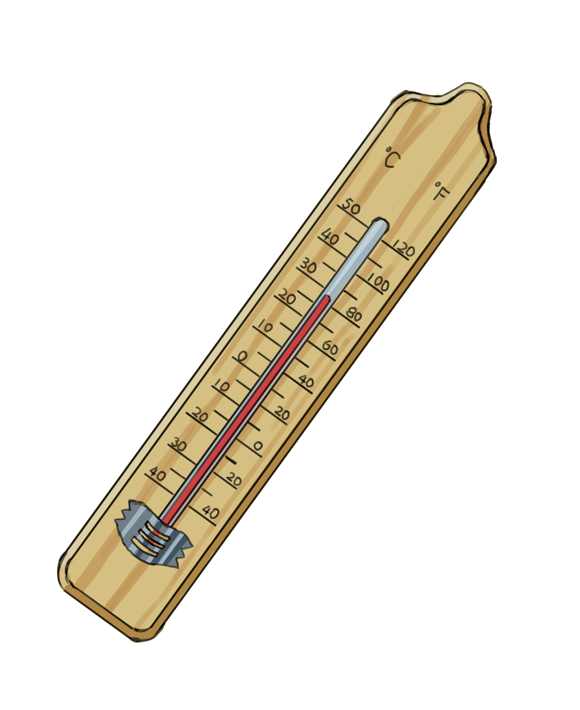
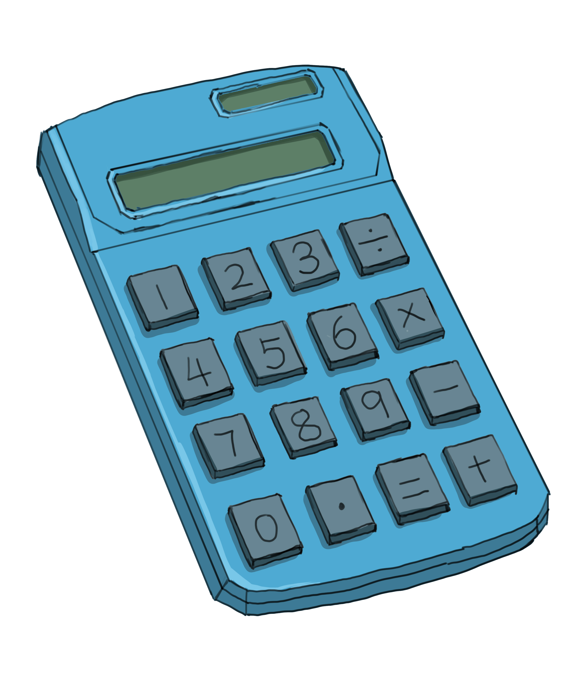
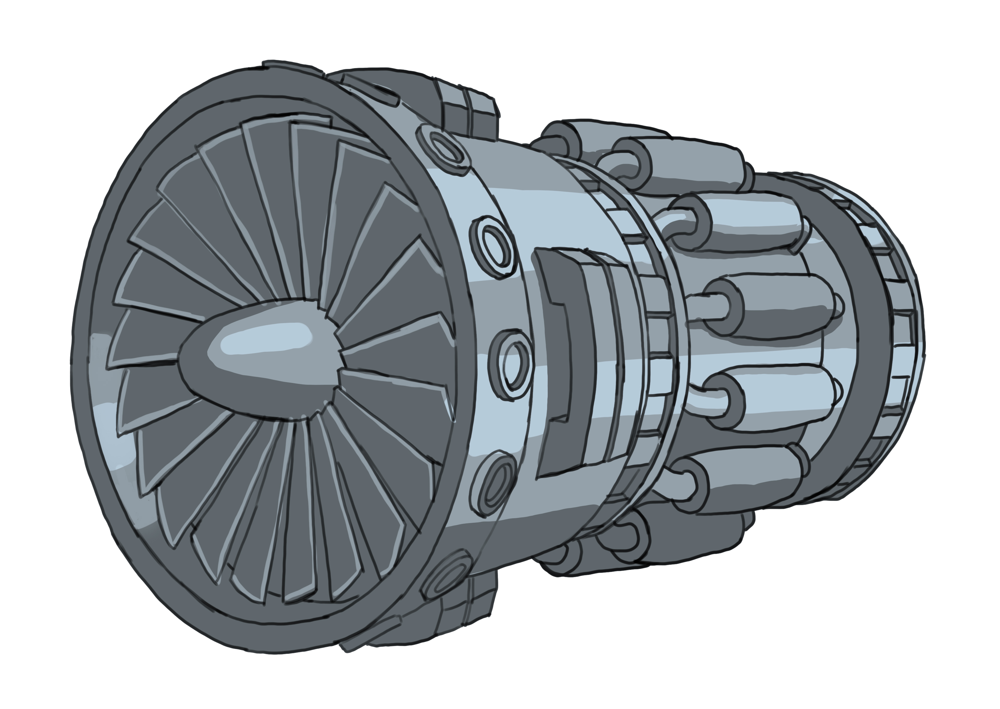
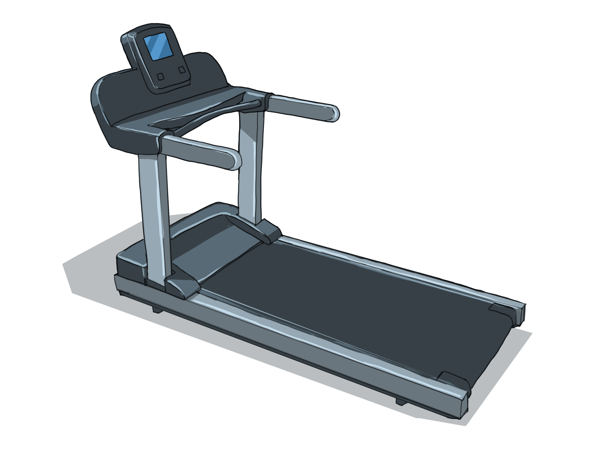

Now that we've gone over everything from breaking down problems to using data types, conditional statements, loops, and functions, it's time to put all these pieces together. In this chapter, we're going to combine everything we've learned and solve various problems.

## Table of Contents

[Arithmetic Operations in Programming](#arithmetic-operations-in-programming)

[Example Problems](#example-problems)

- [Example 1: Celsius to Fahrenheit Converter](#example-1-celsius-to-fahrenheit-converter)
- [Example 2: Even or Odd](#example-2-even-or-odd)
- [Example 3: A Basic Calculator](#example-3-a-basic-calculator)
- [Example 4: Guess the Secret Number](#example-4-guess-the-secret-number)

[Activities](#activities)

[Questions](#questions)

## Arithmetic Operations in Programming

When you think of math, the first things that probably come to mind are the basic arithmetic operations. In programming, these operations are just as essential. Let's dive into each of them:

- Addition **\+** : `3 + 5 = 8`
- Subtraction **\-** : `9 - 4 = 5`
- Multiplication **\*** : `4 * 6 = 24`
- Division **/** : `12 / 3 = 4`

## Example Problems

In this section, we're going to tackle a set of example problems that will take us back through everything we've learned so far. We'll start with simpler examples and gradually ramp up the challenge.

### Example 1: Celsius to Fahrenheit Converter

**Question:** Write a function that converts Celsius temperature to Fahrenheit. After creating this function, demonstrate its use by providing a test case.


*A thermometer displaying temperatures in both Celsius and Fahrenheit.*

**Answer:**

To solve this, it's important to understand the relationship between Celsius and Fahrenheit. To convert Celsius to Fahrenheit, you multiply the Celsius temperature by 9/5 and then add 32. In mathematical terms, the formula is: **Fahrenheit = (Celsius × 9/5) + 32**.

**Pseudocode:**

```typescript
function ConvertToFahrenheit(celsius):
    fahrenheit = celsius * 9/5 + 32
    return fahrenheit
END function
```

**Explanation:**

Regarding the `ConvertToFahrenheit()` function, the name itself gives away its purpose: to convert a given temperature from Celsius to Fahrenheit. Inside the parentheses, we have a parameter named `celsius`, which is the input temperature we want to convert. Within the function, we use a variable named `fahrenheit` to store the result of our conversion. The math behind this conversion is done using the formula `celsius * 9/5 + 32`, a standard way to change Celsius to Fahrenheit. After the calculation, the function then provides the converted temperature using the `return` statement. Essentially, this function takes in a Celsius value, performs the necessary calculations, and then hands back the Fahrenheit equivalent.

**Function call:**

If we want to test this function, we could call it and pass it an argument, like so:

```typescript
ConvertToFahrenheit(10)
```

On execution, the call `ConvertToFahrenheit(10)` should yield a result of `50` Fahrenheit.

### Example 2: Even or Odd

**Question:** Design a function to identify whether a given integer is even or odd. Create the solution using loops, and afterwards, demonstrate the function with a test case.

**Answer:**

To figure out if a number is even or odd using loops, we'll subtract 2 from the number repeatedly until it becomes less than 2. If the result is 0, then the number is even; otherwise, it's odd.

**Pseudocode:**

```typescript
function IsEvenOrOdd(number):
    while number >= 2:
        number = number - 2

    if number == 0:
        return "Even"
    else:
        return "Odd"
    END if
END function
```

**Explanation:**

Think of it like this: if you had 7 apples and you kept giving 2 away at a time, you'd be left with 1 apple. Any time you have 1 apple left (or any number not evenly divisible by 2), that means you started with an odd number. On the other hand, if you kept giving away 2 apples at a time and ended up with none left, you had an even number of apples to start with.

In our loop, we kept subtracting 2 until the number became less than 2. If, after all the subtractions, the number is 0, that means the original number was even. If it's not 0, then it's surely 1. And that's why we can confidently say that the `else` condition covers the "number is odd" case.

**Function call:**

To test our function:

```typescript
IsEvenOrOdd(7)
```

Running the above code, `IsEvenOrOdd(7)` should output `Odd`.

### Example 3: A Basic Calculator

**Question:**

Write a program (no need to use a function) that prompts the user for two numbers and then for an operation (+, -, *, /). Compute and print the result based on the given operation.


*A basic calculator.*

**Answer:**

We'll be collecting two numbers and an operation from the user. After receiving the inputs, we'll determine which arithmetic operation to perform using conditional statements and then display the result.

**Pseudocode:**

```typescript
PRINT "Enter first number: "
INPUT number1
PRINT "Enter second number: "
INPUT number2
PRINT "Enter operation (+, -, *, /): "
INPUT operation

if operation == "+":
    result = number1 + number2
    PRINT result
else if operation == "-":
    result = number1 - number2
    PRINT result
else if operation == "*":
    result = number1 * number2
    PRINT result
else if operation == "/":
    result = number1 / number2
    PRINT result
else:
    PRINT "Unrecognized operation. Please try again."
END if
```

**Explanation:**

In the given pseudocode, we first engage the user by prompting them to provide the first number. Then, we store the user's input in a variable called `number1`. We follow the same process for the second number, saving it in `number2`. Moving on, we then ask the user to choose an arithmetic operation, and their choice is stored in the `operation` variable. With all our inputs gathered, we use conditional statements to decide which calculation to perform.

If the user selects "+", we compute the sum of the two numbers and store it in the `result` variable, which is then promptly printed to show the user their answer. Similarly, for "-", we subtract `number2` from `number1`, again saving and displaying the result using the same variable. For multiplication (denoted by "*"), the two numbers are multiplied, and for division ("/"), `number1` is divided by `number2`, with the outcomes stored in `result` and shown to the user. Lastly, if the operation input is anything other than the given four choices, a message is printed to inform the user that their chosen operation is not recognized.

### Example 4: Guess the Secret Number

**Question:**

Write a program where you store a secret number between 1 and 10 in a variable, and the user has to guess it. The user should be prompted to guess the number until they get it right. Create a function named `Feedback()` to provide feedback on the user's guess. The function should take in the user's guess and the secret number as inputs and return whether the guess is too high, too low, or correct.


*What number is the computer thinking of?*

**Answer:**

We'll set a predefined secret number, and then use a `while` loop to repeatedly ask the user for their guess. If they guess correctly, we'll exit the loop and congratulate them. If not, the `Feedback()` function will provide feedback on their guess, and we'll prompt them to try again.

**Pseudocode:**

```typescript
function Feedback(guess, secret_number):
    if guess < secret_number:
        return "Your guess is too low."
    else if guess > secret_number:
        return "Your guess is too high."
    else:
        return "Congratulations! You've guessed the secret number."
    END if
END function

secret_number = 7
guess = 0

PRINT "Guess the secret number between 1 and 10."

while guess != secret_number:
    PRINT "Enter your guess:"
    INPUT guess
    message = Feedback(guess, secret_number)
    PRINT message
END while
```

**Explanation:**

1. **Function Definition** (`Feedback()`)**:**
    - The program starts by defining the `Feedback()` function. This function is set up to take two parameters: `guess` and `secret_number`.
    - The function checks if `guess` is less than, greater than, or equal to `secret_number` and returns an appropriate message for each case.
    - This function is a predefined set of instructions that will be called later in the program.
2. **Initializing Variables** (`secret_number` and `guess`)**:**
    - The `secret_number` is set to 7. This is the target number users must guess.
    - `guess` is initialized to 0, providing a starting point for the upcoming loop.
3. **Informing the User:**
    - The program then prints a message informing the user that they have to guess a number between 1 and 10.
4. **While Loop:**
    - The `while` loop begins, with the condition `guess != secret_number`. This loop will continue as long as the user’s guess does not match the secret number.
5. **User Input and Feedback:**
    - Inside the loop, the user is asked to enter their guess. The `INPUT` command captures the user's input and assigns it to `guess`.
    - The `Feedback()` function is called with the current `guess` and `secret_number` as arguments. It returns a hint based on how `guess` compares to `secret_number`.
    - The returned message is printed, guiding the user on their next guess.
6. **Exiting the Loop:**
    - If the user’s guess matches the `secret_number` (e.g., the user guesses 7), the condition `guess != secret_number` becomes `False` (as "7 is not equal to 7" is false).
    - This breaks the loop, and the program exits the while block.
7. **End of Program:**
    - Once the loop is exited (when the correct number is guessed), the final message from the `Feedback()` function ("Congratulations! You've guessed the secret number.") is displayed, marking the end of the game.


**Example of Execution:**

Imagine a user interacting with the program:

```text
Guess the secret number between 1 and 10.
Enter your guess:
3
Your guess is too low.
Enter your guess:
8
Your guess is too high.
Enter your guess:
7
Congratulations! You've guessed the secret number.
```

In this execution:

- The user first guessed the number 3, which is too low. The program provides feedback accordingly.
- The user then guessed the number 8, which is too high. Again, the program provides feedback.
- Finally, the user guessed 7, which matches the secret number. The program congratulates the user, and the loop exits.

## Activities

**Activity #1:**

In "Chapter 6: Modularizing Your Code with Functions", we explored the concept of an airplane manufacturing plant. One of the critical divisions in this plant is the "Engine Installation" division.


*An airplane engine.*

This division is responsible for installing engines on the wings of an airplane. Your task is to design a function that simulates the engine installation process by the team.

Function design:

```typescript
function InstallEngines(wings, numberOfEngines):
    // Function body
END function
```

- `wingName`: This parameter represents the wings of the airplane where the engines will be installed.
- `numberOfEngines`: This parameter indicates how many engines need to be installed in total.

In your function, focus on the correct engine distribution per wing. Use the `InstallEngine()` function for attaching each engine, assuming it works perfectly for this task. Similarly, use `SwitchWings()` when you need to switch wings. Both functions are "black boxes" - they're reliable and handle specifics internally, allowing you to concentrate on the overall installation process.

Keep track of the engines installed and ensure that they are distributed evenly. For instance, if `numberOfEngines` is 4, your function should install 2 engines on each wing.

**Answer:**

```typescript
function InstallEngines(wings, numberOfEngines):
    enginesInstalled = 0
    enginesPerWing = numberOfEngines / 2

    while enginesInstalled < numberOfEngines:
        if enginesInstalled == enginesPerWing + 1:
            SwitchWings()
        END if
        AttachEngine() // Steps to install a single engine
        enginesInstalled = enginesInstalled + 1
    END while
    
    return "Engine installation on " + wings + " is complete"
END function
```

1. **Function Declaration:** The algorithm starts with the declaration of the `InstallEngines()` function. This function models the procedure of attaching engines to an airplane's wings. It accepts two parameters: `wings`, symbolizing the airplane's wings (e.g., "Boeing 747 wings"), and `numberOfEngines`, indicating the total number of engines to be installed.
2. **Initializing Variables:** Initially, a counter `enginesInstalled` is set to zero, serving as a tracker for how many engines have been placed. Additionally, `enginesPerWing` calculates the number of engines each wing should ideally hold by dividing the total number of engines by two.
3. **While Loop:** The function then enters a `while` loop, continually installing engines until the desired number, `numberOfEngines`, is met. Inside the loop:
    - **Check to Switch Wings:** If `enginesInstalled` equals `enginesPerWing`, it's time to switch to the other wing, done by calling `SwitchWings()`.
    - **Installing an Engine:** `AttachEngine`() is called to simulate the installation of an engine.
    - **Increment Counter:** After each engine installation, `enginesInstalled` is incremented by 1.
4. **Function Conclusion:** Once all engines are installed, the function returns a message indicating the completion of the installation process on the specified wings.

**Activity #2:**

A local gym wants to implement a promotional discount for its members based on their age and the duration of their membership. They have the following rules:

- Teenagers (younger than 20 years old) who are just about to sign up (0 years of membership) receive a 10% discount.
- Elderly members (55 years and older) who have been a member of the gym for 5 or more years receive a 15% discount.


*A treadmill.*

Write a program for a gym's discount policy, where part of your program includes a function to determine the discount a member is eligible for. This function within your program should take two inputs: the member's age and the length of their gym membership, and it should return the discount percentage. Once the function is set up, the program should prompt the user for their age and membership duration, use the function to calculate the discount, and then display the resulting discount.

**Answer:**

```typescript
function CalculateDiscount(age, membershipDuration):
    discount = 0

    if age < 20 AND membershipDuration == 0:
        discount = 10
    else if age >= 55 AND membershipDuration >= 5:
        discount = 15
    END if

    return discount
END function

// Main Program
PRINT "Enter your age: "
INPUT age

PRINT "Enter number of years you've been a member: "
INPUT membershipDuration

discountPercent = CalculateDiscount(age, membershipDuration)

PRINT "You are eligible for a " + discountPercent + "% discount!"
```

1. **Function Declaration:** The algorithm starts with the declaration of the CalculateDiscount function. This function takes two parameters: the age and membership duration of a gym member.
2. **Initializing Discount:** Within the function, the discount is initialized to 0%. This ensures that if none of the conditions are met, no discount is given.
3. **Conditional Checks:**
    - The first condition checks if the user's age is less than 20 (meaning they're a teenager) AND they have 0 years of membership. If both these conditions are true, the discount is set to 10%.
    - The next condition, an `else if`, checks if the user's age is 55 or above (elderly) `AND` they've been a member for 5 or more years. If both these conditions are satisfied, the discount is set to 15%.
    - If neither condition applies, the discount remains as initially set at 0%. This default outcome is ensured by the initial assignment of 0% to the discount, and the absence of an `else` statement to alter it under any other circumstances.
    - These conditions use the logical `AND` operator, ensuring that both parts of each condition must be true for the discount to be applied.
4. **Return Discount:** The function then returns the determined discount value.
5. **Main Program:** After the function is defined, the main program begins by prompting the user to enter their age followed by the number of years they've been a member of the gym.
6. **Function Call:** The `CalculateDiscount` function is then called with the provided age and membership duration, and the result is stored in the discountPercent variable.
7. **Displaying the Result:** Finally, the program displays the discount the user is eligible for using the `PRINT` statement.
